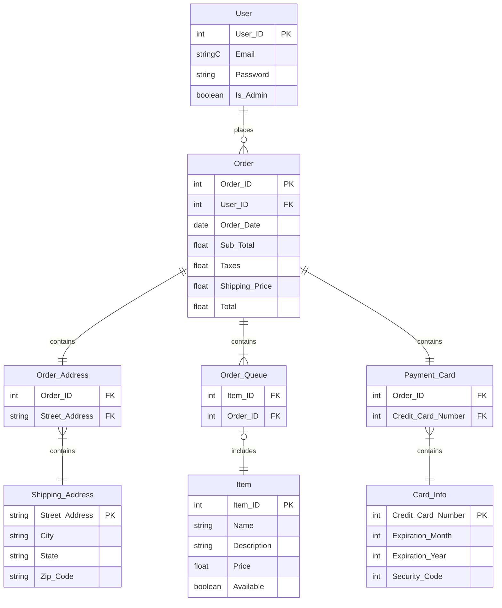

# Technical Design
## Table of Contents
- [Languages](https://github.com/MercyOl/swe-3313-fall-2025-team-06/tree/main/technical-design#languages)
- [Frameworks](https://github.com/MercyOl/swe-3313-fall-2025-team-06/tree/main/technical-design#frameworks)
- [Data Storage Plan](https://github.com/MercyOl/swe-3313-fall-2025-team-06/tree/main/technical-design#data-storage-plan)
- Entity Relationship Diagram
- Entity/Field Descriptions
- Data Examples
- Database Seed Data
- Authentication and Authorization Plan
- Coding Style Guide

## Languages
Schmendrick's Weaponry will be implemented with **Java 23** due to the following:
- Java is a widely used, strongly typed, object-oriented language.
- It provides long-term stability, performance, and an extensive ecosystem of libraries.
- Everyone in our group is at least proficient in Java.

## Frameworks
We will be using [**Spring Boot**](https://spring.io/projects/spring-boot) as our framework, as it is the industry standard for pairing with Java and helps to streamline the development process.
- It is widely used and well-supported in the Java ecosystem
- It works seamlessly with Maven and modern Java versions

## Data Storage Plan
We plan to use JSON as our storage method, as it is lightweight, flexible, and easy to integrate.

We will use the following libraries/technologies to accomplish data storage:
- a JSON document used as a lightweight database
- [Jackson](https://docs.spring.io/spring-boot/reference/features/json.html), a built-in serializer/deserializer in Spring Boot
- The [Java File I/O library](https://howtodoinjava.com/java11/write-string-to-file/?utm_source=chatgpt.com) to read and write to the JSON database
- A small repository class to manage loading, updating, and saving data

The full data storage life cycle will contain the following steps:
1. On application startup, data is read and deserialized using Jackson
2. During runtime, data is serialized and written to the database as updates occur
3. On application shutdown, the data is serialized and written to the database

## ERD Diagram

## Entity/Field Description

### User:
| Property | Type                       | Default | Nullable | Relationship | Notes                           |
|----------|----------------------------|---------|----------|--------------|---------------------------------|
| User_ID  | int, primary key, identity |         | No       |              | Unique ID for each user         |
| Email    | string                     |         | No       |              | User login by email, unique     |
| Password | string                     |         | No       |              | User password                   |
| Is_Admin | boolean                    | T       | No       |              | T = Administrator  F = User |

### Order:
| Property       | Type                       | Default   | Nullable | Relationship           | Notes                                      |
|----------------|----------------------------|-----------|----------|------------------------|--------------------------------------------|
| Order_ID       | int, primary key, identity |           | No       |                        | Unique ID for each order                   |
| User_ID        | int, foreign key           |           | No       | Relate to User.User_ID | Foreign key yo connect an order to a user  |
| Order_Date     | date                       | getDate() | No       |                        | Dated when the oder was placed             |
| Sub_Total      | float                      |           | No       |                        | Total before tax and shipping cost         |
| Taxes          | float                      |           | No       |                        | Shipping price based on shipping selection |
| Shipping_Price | float                      |           | No       |                        | Show amount of taxes                       |
| Total          | float                      |           | No       |                        | Total with taxes and shipping              |

### Order_Address:
| Property       | Type             | Default | Nullable | Relationship                              | Notes |
|----------------|------------------|---------|----------|-------------------------------------------|-------|
| Order_ID       | int, foreign key |         | No       | Relate to Order.Order_ID                  |       |
| Street_Address | int, foreign key |         | No       | Relate to Shipping_Address.Street_Address |       |

### Order_Queue
| Property      | Type             | Default | Nullable | Relationship             | Notes |
|---------------|------------------|---------|----------|--------------------------|-------|
| Item_ID       | int, foreign key |         | No       | Relate to Item.Item_ID   |       |
| Order_ID      | int, foreign key |         | No       | Relate to Order.Order_ID |       |

### Payment_Card

| Property           | Type             | Default | Nullable | Relationship                 | Notes |
|--------------------|------------------|---------|----------|------------------------------|-------|
| Order_ID           | int, foreign key |         | No       | Relate to Order.Order_ID     |       |
| Credit_Card_Number | int, foreign key |         | No       | Card_Info.Credit_Card_Number |       |

### Shipping_Address

| Property       | Type             | Default | Nullable | Relationship | Notes                         |
|----------------|------------------|---------|----------|--------------|-------------------------------|
| Street_Address | int, primary key |         | No       |              | Stress address for the order  |
| City           | string           |         | No       |              | City for shipping address     |
| State          | string           |         | No       |              | State for shipping address    |
| Zip_Code       | string           |         | No       |              | Zip Code for shipping address |

### Item
| Property    | Type             | Default | Nullable | Relationship | Notes                              |
|-------------|------------------|---------|----------|--------------|------------------------------------|
| Item_ID     | int, primary key |         | No       |              | Unique ID for the Item             |
| Name        | string           |         | No       |              | Name given to the item             |
| Description | string           |         | No       |              | Description of the item            |
| Price       | float            |         | No       |              | Amount of money for the iem        |
| Available   | boolean          | T       | No       |              | T = in stock  F = out of stock |

### Card_Info
| Property           | Type             | Default | Nullable | Relationship | Notes                             |
|--------------------|------------------|---------|----------|--------------|-----------------------------------|
| Credit_Card_Number | int, primary key |         | No       |              | Unique number for the user's card |
| Expiration_Month   | int              |         | No       |              | Expiration month on user's card   |
| Expiration_Year    | int              |         | No       |              | Expiration year on user's card    |
| Security_Code      | int              |         | No       |              | 3 digits code on user's card      |

## Data Examples

### User:
| User_ID | Email              | Password  | Is_Admin |
|---------|--------------------|-----------|----------|
| 1       | mcqueen@gmail.com  | McQueen95 | False    |
| 2       | hootyhoo@gmail.com | GoOwl2028 | False    |
| 3       | SFAdmin1@gmail.com | SFA0002   | True     |

### Order:
| Order_ID | User_ID | Order_Date | Sub_Total | Taxes  | Shipping_Price | Total   |
|----------|---------|------------|-----------|--------|----------------|---------|
| 1        | 1       | 07/20/2005 | 128.99    | $9.02  | $15.99         | $154.00 |
| 2        | 3       | 11/24/2025 | 299.99    | $20.29 | $10.99         | $331.27 |
| 3        | 2       | 12/18/2025 | 600.89    | $42.06 | $15.99         | $658.94 |

### Item:

| Item_ID | Name              | Description                                                                        | Price   | Available |
|---------|-------------------|------------------------------------------------------------------------------------|---------|-----------|
| 1       | Stormwell's Vow   | A long, silvered spear etched with spiraling runes that glow during thunderstorms. | $128.99 | True      |
| 2       | Emberfall Edge    | A curved blade forged from volcanic glass fused with ancient dragonfire            | $299.99 | True      |
| 3       | Gloam lantern Bow | A midnight-black bow strung with a thread of woven starlight.                      | $600.89 | True      |

### Card_Info:

| Credit_Card_Number  | Expiration_Month | Expiration_Year | Security_Code |
|---------------------|------------------|-----------------|---------------|
| 4111 1111 1111 1111 | 1                | 2030            | 367           |
| 5555 5555 5555 4444 | 12               | 2026            | 591           |
| 3782 822463 10005   | 7                | 2032            | 265           | 

### Shipping_Address

| Street_Address   | City           | State | Zip_Code |
|------------------|----------------|-------|----------|
| 3124 Flower Pl   | Lawrenceville  | GA    | 30043    |
| 293 Express Ln   | Sugar Mountain | NC    | 28604    |
| 506 Spiderman Rd | Brooklyn       | NY    | 11201    | 

### Order_Address

| Order_ID | Street_Address    |
|----------|-------------------|
| 2        | 293 Express Ln    |
| 1        | 506 Spiderman Rd  |
| 3        | 3124 Flower Pl    | 

### Order_Queue

| Order_ID | Item_ID |
|----------|---------|
| 2        | 1       |
| 1        | 2       |
| 3        | 3       | 

### Payment_Card
| Order_ID | Credit_Card_Number   |
|----------|----------------------|
| 2        | 4111 1111 1111 1111  |
| 1        | 5555 5555 5555 4444  |
| 3        | 3782 822463 10005    | 

