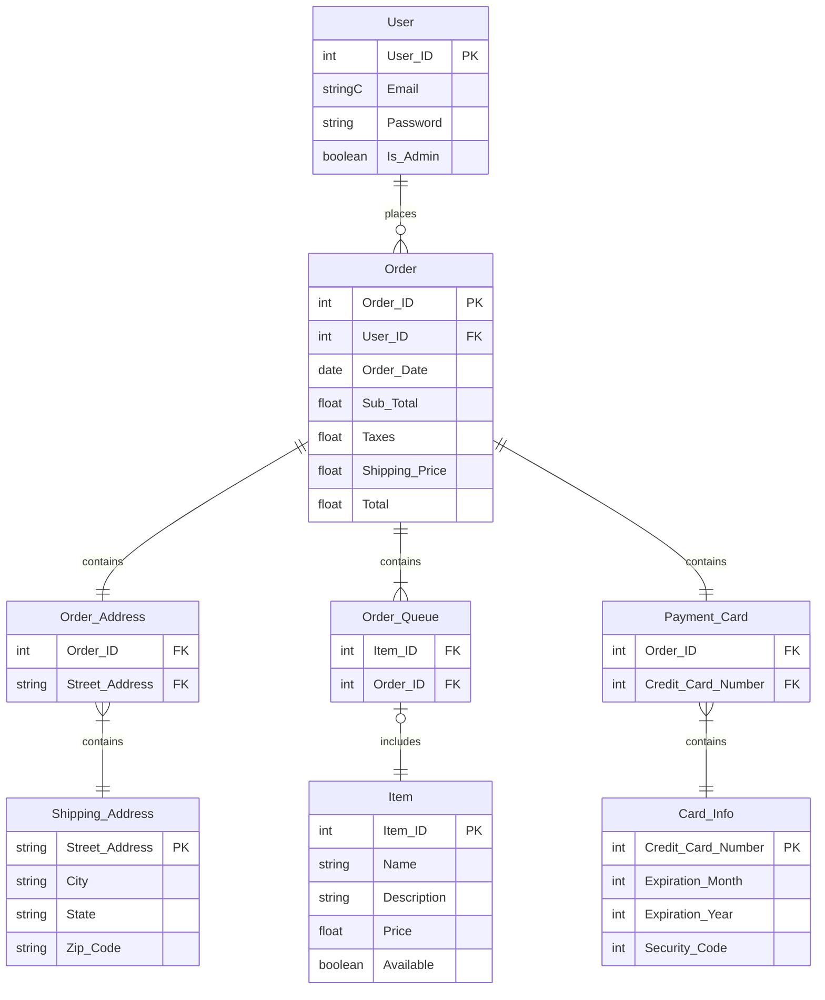

# Technical Design
## Table of Contents
- [Languages](https://github.com/MercyOl/swe-3313-fall-2025-team-06/tree/main/technical-design#languages)
- [Frameworks](https://github.com/MercyOl/swe-3313-fall-2025-team-06/tree/main/technical-design#frameworks)
- [Data Storage Plan](https://github.com/MercyOl/swe-3313-fall-2025-team-06/tree/main/technical-design#data-storage-plan)
- [Entity Relationship Diagram](https://github.com/MercyOl/swe-3313-fall-2025-team-06/blob/main/technical-design/README.md#erd-diagram)
- [Entity/Field Descriptions](https://github.com/MercyOl/swe-3313-fall-2025-team-06/blob/main/technical-design/README.md#entityfield-description)
- [Data Examples](https://github.com/MercyOl/swe-3313-fall-2025-team-06/blob/main/technical-design/README.md#data-examples)
- [Database Seed Data](https://github.com/MercyOl/swe-3313-fall-2025-team-06/blob/main/technical-design/README.md#database-seed-data)
- [Authentication and Authorization Plan](https://github.com/MercyOl/swe-3313-fall-2025-team-06/blob/main/technical-design/README.md#authentication-and-authorization)
- [Coding Style Guide](https://github.com/MercyOl/swe-3313-fall-2025-team-06/edit/main/technical-design/README.md#coding-guidelines)
- [Technical Design Presentation](https://github.com/MercyOl/swe-3313-fall-2025-team-06/edit/main/technical-design/README.md#presentation)

## Languages
Schmendrick's Weaponry will be implemented with **Java 23** due to the following:
- Java is a widely used, strongly typed, object-oriented language.
- It provides long-term stability, performance, and an extensive ecosystem of libraries.
- Everyone in our group is at least proficient in Java.

## Frameworks
We will be using [**Spring Boot**](https://spring.io/projects/spring-boot) as our framework, as it is the industry standard for pairing with Java and helps to streamline the development process.
- It is widely used and well-supported in the Java ecosystem
- It works seamlessly with Maven and modern Java versions

## Data Storage Plan
We plan to use JSON as our storage method, as it is lightweight, flexible, and easy to integrate.

We will use the following libraries/technologies to accomplish data storage:
- a JSON document used as a lightweight database
- [Jackson](https://docs.spring.io/spring-boot/reference/features/json.html), a built-in serializer/deserializer in Spring Boot
- The [Java File I/O library](https://howtodoinjava.com/java11/write-string-to-file/?utm_source=chatgpt.com) to read and write to the JSON database
- A small repository class to manage loading, updating, and saving data

The full data storage life cycle will contain the following steps:
1. On application startup, data is read and deserialized using Jackson
2. During runtime, data is serialized and written to the database as updates occur
3. On application shutdown, the data is serialized and written to the database

## ERD Diagram


## Entity/Field Description

### User:
| Property | Type                       | Default | Nullable | Relationship | Notes                           |
|----------|----------------------------|---------|----------|--------------|---------------------------------|
| User_ID  | int, primary key, identity |         | No       |              | Unique ID for each user         |
| Email    | string                     |         | No       |              | User login by email, unique     |
| Password | string                     |         | No       |              | User password                   |
| Is_Admin | boolean                    | T       | No       |              | T = Administrator <br/>F = User |

### Order:
| Property       | Type                       | Default   | Nullable | Relationship           | Notes                                      |
|----------------|----------------------------|-----------|----------|------------------------|--------------------------------------------|
| Order_ID       | int, primary key, identity |           | No       |                        | Unique ID for each order                   |
| User_ID        | int, foreign key           |           | No       | Relate to User.User_ID | Foreign key yo connect an order to a user  |
| Order_Date     | date                       | getDate() | No       |                        | Dated when the oder was placed             |
| Sub_Total      | float                      |           | No       |                        | Total before tax and shipping cost         |
| Taxes          | float                      |           | No       |                        | Shipping price based on shipping selection |
| Shipping_Price | float                      |           | No       |                        | Show amount of taxes                       |
| Total          | float                      |           | No       |                        | Total with taxes and shipping              |

### Order_Address:
| Property       | Type             | Default | Nullable | Relationship                              | Notes |
|----------------|------------------|---------|----------|-------------------------------------------|-------|
| Order_ID       | int, foreign key |         | No       | Relate to Order.Order_ID                  |       |
| Street_Address | int, foreign key |         | No       | Relate to Shipping_Address.Street_Address |       |


### Order_Queue
| Property      | Type             | Default | Nullable | Relationship             | Notes |
|---------------|------------------|---------|----------|--------------------------|-------|
| Item_ID       | int, foreign key |         | No       | Relate to Item.Item_ID   |       |
| Order_ID      | int, foreign key |         | No       | Relate to Order.Order_ID |       |

### Payment_Card

| Property           | Type             | Default | Nullable | Relationship                 | Notes |
|--------------------|------------------|---------|----------|------------------------------|-------|
| Order_ID           | int, foreign key |         | No       | Relate to Order.Order_ID     |       |
| Credit_Card_Number | int, foreign key |         | No       | Card_Info.Credit_Card_Number |       |

### Shipping_Address

| Property       | Type             | Default | Nullable | Relationship | Notes                         |
|----------------|------------------|---------|----------|--------------|-------------------------------|
| Street_Address | int, primary key |         | No       |              | Stress address for the order  |
| City           | string           |         | No       |              | City for shipping address     |
| State          | string           |         | No       |              | State for shipping address    |
| Zip_Code       | string           |         | No       |              | Zip Code for shipping address |

### Item
| Property    | Type             | Default | Nullable | Relationship | Notes                              |
|-------------|------------------|---------|----------|--------------|------------------------------------|
| Item_ID     | int, primary key |         | No       |              | Unique ID for the Item             |
| Name        | string           |         | No       |              | Name given to the item             |
| Description | string           |         | No       |              | Description of the item            |
| Price       | float            |         | No       |              | Amount of money for the iem        |
| Available   | boolean          | T       | No       |              | T = in stock<br/> F = out of stock |

### Card_Info
| Property           | Type             | Default | Nullable | Relationship | Notes                             |
|--------------------|------------------|---------|----------|--------------|-----------------------------------|
| Credit_Card_Number | int, primary key |         | No       |              | Unique number for the user's card |
| Expiration_Month   | int              |         | No       |              | Expiration month on user's card   |
| Expiration_Year    | int              |         | No       |              | Expiration year on user's card    |
| Security_Code      | int              |         | No       |              | 3 digits code on user's card      |

## Data Examples

### User:
| User_ID | Email              | Password  | Is_Admin |
|---------|--------------------|-----------|----------|
| 1       | mcqueen@gmail.com  | McQueen95 | False    |
| 2       | hootyhoo@gmail.com | GoOwl2028 | False    |
| 3       | SFAdmin1@gmail.com | SFA0002   | True     |

### Order:
| Order_ID | User_ID | Order_Date | Sub_Total | Taxes  | Shipping_Price | Total   |
|----------|---------|------------|-----------|--------|----------------|---------|
| 1        | 1       | 07/20/2005 | 128.99    | $9.02  | $15.99         | $154.00 |
| 2        | 3       | 11/24/2025 | 299.99    | $20.29 | $10.99         | $331.27 |
| 3        | 2       | 12/18/2025 | 600.89    | $42.06 | $15.99         | $658.94 |

### Item:

| Item_ID | Name              | Description                                                                        | Price   | Available |
|---------|-------------------|------------------------------------------------------------------------------------|---------|-----------|
| 1       | Stormwell's Vow   | A long, silvered spear etched with spiraling runes that glow during thunderstorms. | $128.99 | True      |
| 2       | Emberfall Edge    | A curved blade forged from volcanic glass fused with ancient dragonfire            | $299.99 | True      |
| 3       | Gloam lantern Bow | A midnight-black bow strung with a thread of woven starlight.                      | $600.89 | True      |

### Card_Info:

| Credit_Card_Number  | Expiration_Month | Expiration_Year | Security_Code |
|---------------------|------------------|-----------------|---------------|
| 4111 1111 1111 1111 | 1                | 2030            | 367           |
| 5555 5555 5555 4444 | 12               | 2026            | 591           |
| 3782 822463 10005   | 7                | 2032            | 265           | 

### Shipping_Address

| Street_Address   | City           | State | Zip_Code |
|------------------|----------------|-------|----------|
| 3124 Flower Pl   | Lawrenceville  | GA    | 30043    |
| 293 Express Ln   | Sugar Mountain | NC    | 28604    |
| 506 Spiderman Rd | Brooklyn       | NY    | 11201    | 

### Order_Address

| Order_ID | Street_Address    |
|----------|-------------------|
| 2        | 293 Express Ln    |
| 1        | 506 Spiderman Rd  |
| 3        | 3124 Flower Pl    | 

### Order_Queue

| Order_ID | Item_ID |
|----------|---------|
| 2        | 1       |
| 1        | 2       |
| 3        | 3       | 

### Payment_Card
| Order_ID | Credit_Card_Number   |
|----------|----------------------|
| 2        | 4111 1111 1111 1111  |
| 1        | 5555 5555 5555 4444  |
| 3        | 3782 822463 10005    | 

---
## Database Seed Data
Our database will have 2 types of seed data: Items and Users. There will be 14 items in the database, as well as 1 generic admin account saved.


---
## Authentication and Authorization
Everyone logs in using the same log-in screen. When someone types their email and password the system looks up their record in json. The system authenticates the user by using their email and password to lookup their user ID.

While building the Authentication we turn the user’s roles/permissions into Spring GrantedAuthority objects (we can also add a special authority like IS_ADMIN when isAdmin == true). We can then put the isAdmin flag from the database on the GrantedAuthority objects so service code can check principal.isAdmin() directly.

After login, every request goes through Spring Security. Spring checks the session, gets the Authentication, and enforces our rules. 


### Example code:

```
public final class User {
	private String id;
	private String email;
	private String password;
	private Set<String> roles;
	private Set<String> permissions;
	private boolean isAdmin;
	
	// getters

	@Override
	public boolean equals(User u){
		if(u.getEmail() == email && u.getPassword() == password){
			return true;
		}
		return false
	}
}
```

```
public Authentication authenticate(String email, String password, List<User> users) {
    // find the user
    User user = null;
	for(int i = 0; i < users.size(); i++){
		if(users.get(i).equals(new User(email, password))){
			user = users.get(i);
		}
	}

    if (user == null) return null;		// fail if not found

    // build authorities
    Set<GrantedAuthority> auth = new HashSet<>();
    user.getRoles().forEach(r -> auth.add(new SimpleGrantedAuthority(r)));
    user.getPermissions().forEach(p -> auth.add(new SimpleGrantedAuthority(p)));

    if (user.getAdmin()) {
        auth.add(new SimpleGrantedAuthority("IS_ADMIN"));
    }

    // create Authentication object
    return new UsernamePasswordAuthenticationToken(user.getId(), null, auth);
}
```

---

# Coding Style Guide

These coding guidelines ensure that all contributors write code that is consistent, readable, easy to maintain, and aligned with best practices.  
Inspired by [Cornell University’s Java Code Style Guidelines](https://www.cs.cornell.edu/courses/JavaAndDS/JavaStyle.html#Indentation). 
A draft of this style guide was written, and AI was used to format it into markdown and refine the guide. Java syntax examples were written using pseudocode and formatted in Java by AI.

---

## 1. Technology Stack Overview

- **Language:** Java 23  
- **Framework:** Spring  
- **Build System:** Maven  
- **Data Storage (v1):** JSON  
- **Runtime Environments:** Windows 11 and Linux  
- **IDE:** IntelliJ IDEA  
- **Source Control:** GitHub, with branching and code review workflow  

---

## 2. Code Style & Naming Conventions

### 2.1 Naming Standards

- **Classes & Interfaces:** PascalCase  
  - Example: `InventoryManager`
- **Methods, Fields, Local Variables:** camelCase  
  - Example: `calculateTotal`
- **Constants:** UPPER_SNAKE_CASE (`static final`)  
  - Example: `OVERNIGHT_SHIPPING_RATE`
- **Packages:** lowercase, dot-separated  
  - Example: `com.example.store.service`
- **Boolean Variables:** prefix with `is`, `has`, or `can`  
  - Example: `isSold`, `isAvailable`

### 2.2 General Naming Guidance

- Parameter names should be short but meaningful.  
- Declare local variables close to first use.  
- Avoid abbreviations unless widely understood (i.e., `url`).  

---

## 3. Formatting & Code Structure

### 3.1 Formatting

- Use the **tab key** for indentation.  
- Keep lines under **100 characters**. 
- Opening braces stay on the same line:  
  ```java
  if (condition) {
      ...
  }
  ```
- Always use braces for control structures.  
- One statement per line.  
- Use blank lines to separate logical code sections.  
- Prefer explicit types when it improves clarity.

---

## 4. Documentation & Commenting

### 4.1 Javadoc Expectations

All **public classes** and **methods** must include Javadoc describing:

- Purpose of the class/method  
- Summary of the return value  
- Preconditions or any other notes if available

That way, team members can understand the code, even if they did not write it themselves.

### 4.2 In-Method Comments

- Explain **what** a block of code does.  
- Add a blank line after the comment.

Example:
```java
// Calculates the total cost of items in the cart
BigDecimal subtotal = calculateSubtotal(cart);
```

Do not comment too much. Assume the viewer has basic Java Knowledge.

---

## 5. Design Principles & Code Organization

- Avoid combining unrelated responsibilities in a single class.  
- Prefer layering: controllers → services → models.  
- Place fields and class-level variables at the top of the class.  
- Use encapsulation:  
  - `public` for what the user can see and access
  - `private` for internal functions
- Static variables should generally be private.

---

## 6. Best Practices for Java

### 6.1 Exceptions & Naming

- Use standard exceptions when possible (e.g., `IllegalArgumentException`).  
- Custom exceptions must clearly describe the issue (e.g., `DuplicateProductException`).  
- Avoid outdated methods or APIs.

---

## 7. Money & Numerical Handling

### 7.1 Use BigDecimal for All Money

```java
new BigDecimal("1000.00");
```

- Do not use `double` or `float` for currency.

### 7.2 JSON Storage

Store monetary values as **strings with two decimal places**:

```json
"price": "50.00"
```

### 7.3 Display Formatting

Use:
```java
NumberFormat.getCurrencyInstance(Locale.US)
```
For values like `$100.00`.

---

## 8. GitHub Workflow

### 8.1 Branching

- **main:** where we store the final implementation
- **develop:** where will integrate
- **feature branches:**  If you want to work on a specific feature. Name it as shown below.
  ```
  feature/<description>
  ```

### 8.2 Commit Messages

Use **Conventional Commits** (short, descriptive):

```
feat(cart): add subtotal calculation
fix(auth): resolve token expiration bug
```

### 8.3 Pull Requests

- Pull requests must target `develop` or `main`.  
- Require 1–2 team members to review.  

---

# Presentation

